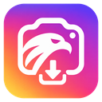

# Instagram to Eagle

A Firefox extension that saves Instagram photos, videos, carousels, Reels, and Stories directly to your [Eagle](https://eagle.cool/) library, with a short title, source link, and optional tags.

[Download v0.9.2](https://github.com/karlwang3420/instagram-to-eagle/raw/refs/heads/main/dist/instagram-to-eagle-0.9.2-unsigned.xpi) · [Changelog](CHANGELOG.md) · [Development](docs/DEVELOPMENT.md) · [Privacy](PRIVACY.md)

## Install

You need desktop **Firefox 140+**, Eagle running with a library open, and an Instagram session in Firefox.

1. Download the XPI using the link above.
2. Open `about:debugging#/runtime/this-firefox` in Firefox.
3. Click **Load Temporary Add-on…** and select the downloaded XPI.
4. On the setup page, click **Allow access** if prompted, then approve access to Instagram and Eagle on your computer.
5. Reload your Instagram tabs. Open the extension popup to choose an Eagle folder and tag preferences.

The current build is **unsigned** and is removed when Firefox restarts. A permanent installation requires a [Mozilla-signed build](https://extensionworkshop.com/documentation/publish/signing-and-distribution-overview/).

To update, load the new XPI and reload your Instagram tabs. Reloading an older XPI does not replace its contents.

## Save media

Keep Eagle running while you save. Download buttons appear directly on Instagram; hover or focus a button to see its label.

| Where | What to click |
| --- | --- |
| Single photo or video | Download button beside the bookmark |
| Carousel | Top-right button for the current item; button beside the bookmark for the whole post |
| Profile grid | Hover or focus a thumbnail, then click its download button to save the whole post |
| Reel player | Download button near the top-right playback controls |
| Story viewer | **Current story** or **All available stories from this account** |

Whole-post imports include images and videos in carousel order. If the extension cannot verify every item, it reports an error instead of importing an incomplete batch.

“Sent to Eagle” means Eagle accepted the request. Check Eagle for the completed import; if a request times out, check your library before retrying.

## Folders and tags

Use the extension popup to choose a destination folder; the default is **Unfiled**. Three tag switches are enabled by default:

- **Default tags:** `Instagram`, plus `Story` or `Reel` when applicable.
- **Post hashtags:** hashtags from the caption.
- **Creator:** the author's `@username`.

Turn all three off to import without tags. Each item keeps a short title and its Instagram source link; the annotation field stays empty.

## Limitations

- Instagram changes can break media detection. Some posts may need to be opened directly before saving.
- Videos require a direct media file. Streams available only as DASH/HLS segments are unsupported.
- Stories must be available to your current session. Highlights, archives, and expired Stories are unsupported, and Story source links may stop working after expiry.
- Saving an entire profile and right-click menu downloads are not supported.

## Privacy

The extension talks to Instagram and Eagle's local API at `http://127.0.0.1:41595`. It has no analytics or external backend. Your Instagram login cookies are not copied to Eagle or stored in extension settings.

Instagram access and scripting permissions let the extension find media on the page. Localhost access lets it send imports to Eagle. Storage holds your destination folder and tag preferences.

Read the [privacy policy](PRIVACY.md) for details about network requests, local storage, and your choices.

## Development

Clone this repository and load `manifest.json` through **Load Temporary Add-on…**. No build step or runtime dependencies are required.

See the [development guide](docs/DEVELOPMENT.md) for testing, packaging, and icon generation, and the [changelog](CHANGELOG.md) for version history.

## License

[MIT](LICENSE). This is an independent project, not affiliated with or endorsed by Instagram, Meta, or Eagle.
